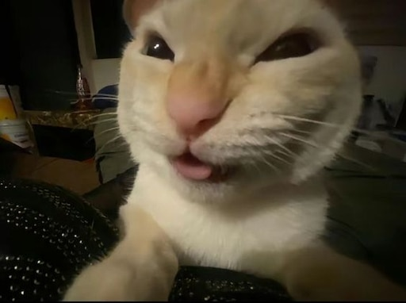

# Ivan Erokhin


## About Me
27 years old, actively learning modern web development with a strong focus on creating high-quality, user-centric applications. Committed to continuous improvement, clean code, and delivering real value through intuitive digital experiences.

## Skills
* HTML
* CSS
* JavaScript
* Git

## Projects
* [shelter](https://rolling-scopes-school.github.io/donnyg-JSFEPRESCHOOL2024Q2/shelter/)
* [christmas-shop](https://rolling-scopes-school.github.io/donnyg-JSFE2024Q4/christmas-shop/)
* [audio-player](https://rolling-scopes-school.github.io/donnyg-JSFEPRESCHOOL2024Q2/audio-player/)
* [image-gallery](https://rolling-scopes-school.github.io/donnyg-JSFEPRESCHOOL2024Q2/image-gallery/)
* [cssMemeSlider](https://donnyg.github.io/cssMemeSlider/cssMemeSlider/)
* [museum](https://rolling-scopes-school.github.io/donnyg-JSFEPRESCHOOL2025Q2/museum/)
* [not-fight-club](https://donnyg.github.io/not-fight-club/)


## Education
* Courses:
  * [JavaScript / Front-end Pre-School 2024Q2 at RS School](https://rs.school/courses/javascript-preschool-ru)
  * [JavaScript / Front-end Pre-School 2025Q2 at RS School](https://rs.school/courses/javascript-preschool-ru)
  * [JavaScript / Front-end 2025Q3 at RS School](https://rs.school/courses/javascript-ru)
* English: A2

## Code Example
```
function multiply(a, b) {
  return a * b;
}
```

## Contacts
* GitHub: [@donnyg](https://github.com/donnyg)
* Discord: [@wawthegoat](https://discord.com/users/wawthegoat)
